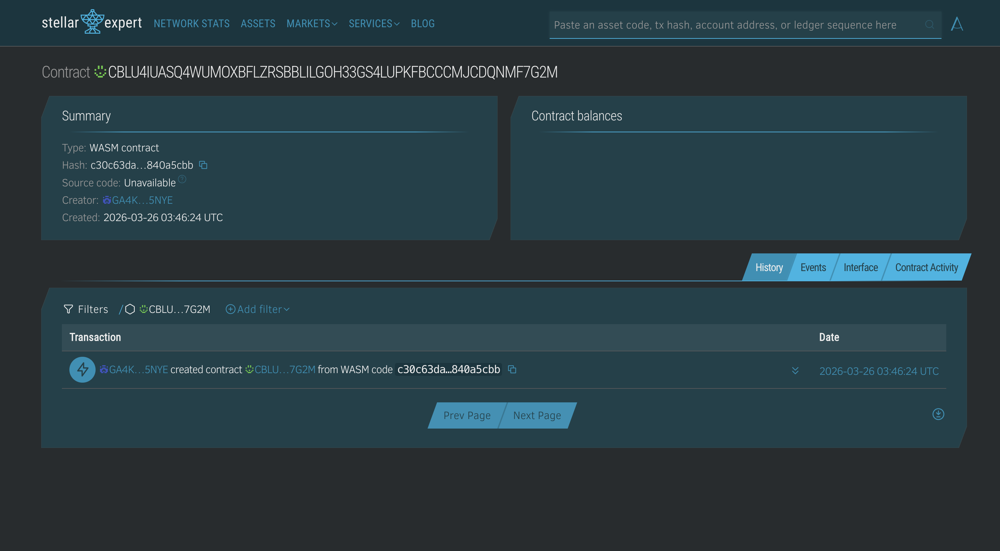
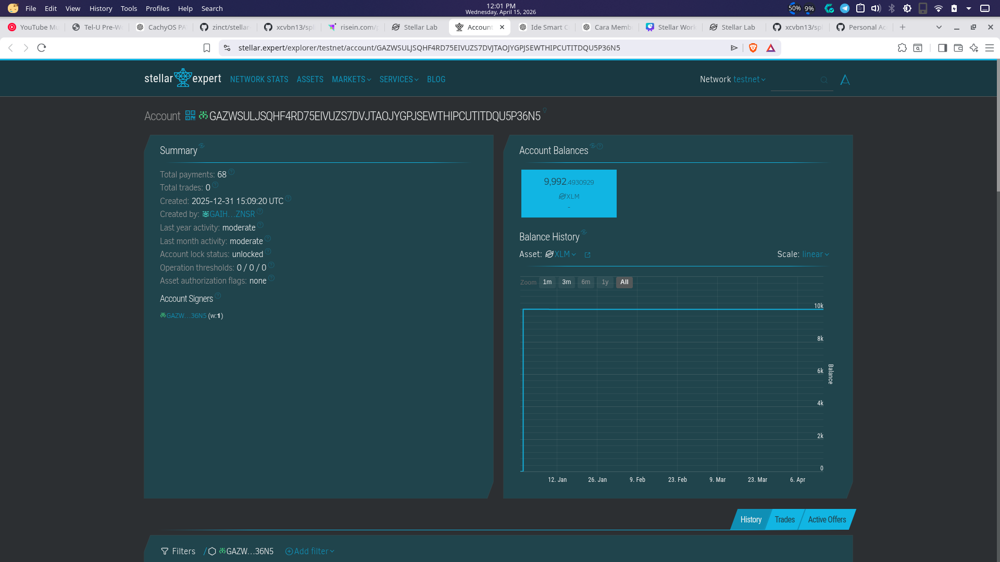

# Split Bill Smart Contract (Soroban)

## Application Description

This project is a Soroban smart contract that supports split-bill payments on Stellar.

One user (the creator) pays first, then each member must reimburse their share before a deadline. The contract keeps funds in escrow, applies a late penalty automatically when needed, and transfers the total amount to the creator once all members have paid.

## Features

- Multi-bill support in a single contract instance.
- Per-member split amounts for each bill.
- Payment deadline per bill.
- Automatic late-penalty calculation.
- Escrow model using Soroban token transfers.
- Automatic settlement to the creator when all members are paid.
- Bill status tracking (paid, unpaid, late, total collected, settled).

## Smart Contract (Testnet)

- Contract ID (Testnet): `CDRPHVZXXQMTQBL56YDNUL44PFYVPJT4ASNZNAKV22KG5T22PZD757F6`

## Public Contract Methods

- `create_bill(creator, token, members, amounts, deadline, penalty_percent) -> bill_id`
- `pay_share(bill_id, member)`
- `get_bill(bill_id) -> Bill`
- `get_member_due(bill_id, member) -> i128`

## Testnet Screenshot

Below is a placeholder screenshot section for your deployed testnet contract view:




## Setup

### Prerequisites

- Rust (stable)
- Cargo
- Stellar CLI (`stellar`)

### Install Dependencies

```bash
cargo --version
stellar --version
```

### Build Contract

```bash
cd contracts/notes
stellar contract build
```

## Running Tests

```bash
cd contracts/notes
cargo test
```

## Usage

Typical flow when interacting with this smart contract:

1. Call `create_bill(...)` as the creator and store the returned `bill_id`.
2. Each member checks how much they owe by calling `get_member_due(bill_id, member)`.
3. Each member pays through `pay_share(bill_id, member)`.
4. Track progress with `get_bill(bill_id)`.
5. Once all members are paid, settlement to the creator happens automatically.

## Explanation

This contract implements a split-bill escrow mechanism:

- The contract stores each bill using a unique `bill_id` (`DataKey::Bill(bill_id)`), allowing multiple active bills.
- During payment, the contract verifies the member and computes the due amount.
- If payment is after the bill deadline, a penalty is added automatically.
- Funds are transferred from member to contract escrow first.
- When all members are marked paid, the contract transfers the full collected amount to the bill creator and marks the bill as settled.

Current test coverage includes:

- On-time payment settlement.
- Late payment with penalty.
- Multiple active bills isolation.
